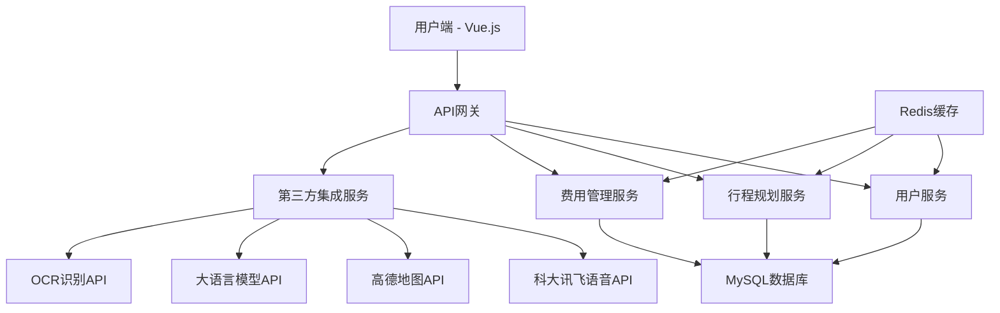

# AI 旅行规划师 (AI Travel Planner) 产品需求文档 (PRD)

## 1. 产品概述

### 1.1 产品定位
AI 旅行规划师是一款基于人工智能的智能旅行规划Web应用，旨在通过AI技术简化旅行规划过程，为用户提供个性化的旅行路线规划、费用管理和实时旅行辅助服务。

### 1.2 产品愿景
成为用户首选的智能旅行规划助手，让每一次旅行都变得简单、高效、个性化。

### 1.3 目标用户
- **主要用户群体**：25-45岁有一定消费能力的旅行爱好者
- **次要用户群体**：家庭出游用户、商务差旅人士
- **用户特征**：
  - 注重旅行体验和效率
  - 愿意尝试新技术
  - 有一定的互联网使用经验
  - 对个性化服务有需求

## 2. 核心功能需求

### 2.1 智能行程规划

#### 2.1.1 功能描述
用户通过语音或文字输入旅行需求，AI自动生成个性化旅行路线。

#### 2.1.2 详细需求
**输入方式：**
- 语音输入（必须功能）
- 文字输入（备选方式）

**输入信息包括：**
- 旅行目的地（必填）
- 旅行日期（必填）
- 预算范围（必填）
- 同行人数（必填）
- 旅行偏好（选填）：美食、购物、文化、自然风光、娱乐、亲子等
- 特殊需求（选填）：无障碍设施、宠物友好等

**输出内容：**
- 详细行程安排（按天分解）
- 交通方案（航班、高铁、当地交通）
- 住宿推荐（酒店等级、位置、价格）
- 景点推荐（开放时间、门票价格、游玩时长）
- 餐厅推荐（菜系、价位、特色菜品）
- 购物建议
- 注意事项和旅行贴士

#### 2.1.3 技术实现
- **语音识别**：集成科大讯飞语音识别API
- **AI规划引擎**：调用大语言模型API（如OpenAI GPT、百度文心一言等）
- **地理信息**：集成高德地图API获取位置信息
- **数据源**：整合旅游景点、酒店、餐厅等第三方数据

### 2.2 费用预算与管理

#### 2.2.1 功能描述
AI自动进行预算分析，用户可记录和管理旅行开销。

#### 2.2.2 详细需求
**预算分析：**
- 根据目的地、日期、人数自动估算总预算
- 按类别分解预算：交通、住宿、餐饮、景点、购物、其他
- 提供不同预算档次的方案（经济型、舒适型、豪华型）

**费用记录：**
- 支持语音录入费用信息
- 支持手动输入费用
- 支持拍照识别票据
- 按类别统计实际支出
- 预算vs实际对比分析

**费用管理：**
- 实时预算提醒
- 超支预警
- 费用统计报表
- 历史消费分析

#### 2.2.3 技术实现
- **语音识别**：科大讯飞语音识别API
- **OCR识别**：百度OCR API识别票据
- **数据分析**：后端Java服务进行统计分析
- **图表展示**：前端Vue + ECharts展示数据

### 2.3 用户管理与数据存储

#### 2.3.1 注册登录系统

**功能需求：**
- 手机号注册/登录
- 邮箱注册/登录
- 第三方登录（微信、QQ、微博）
- 密码找回功能
- 用户信息管理

**安全要求：**
- 密码加密存储
- JWT token认证
- 登录状态管理
- 防暴力破解

#### 2.3.2 云端数据同步

**同步内容：**
- 旅行计划数据
- 用户偏好设置
- 费用记录
- 历史行程

**技术实现：**
- 实时数据同步
- 离线数据缓存
- 数据冲突处理
- 多设备状态同步

## 3. 技术架构设计

### 3.1 整体架构



### 3.2 前端技术栈

**核心框架：**
- Vue.js 3.x
- Vue Router 4.x
- Pinia (状态管理)
- Vite (构建工具)

**UI组件库：**
- Element Plus
- 自定义组件库

**地图集成：**
- 高德地图 JavaScript API
- 地图标记和路线规划

**语音功能：**
- 科大讯飞 WebAPI
- Web Audio API

**其他工具：**
- Axios (HTTP客户端)
- ECharts (图表库)
- Day.js (日期处理)

### 3.3 后端技术栈

**核心框架：**
- Spring Boot 2.7.x
- Spring Security (安全框架)
- Spring Data JPA (数据访问)
- Spring Cloud Gateway (API网关)

**数据库：**
- MySQL 8.0 (主数据库)
- Redis 6.x (缓存)

**第三方集成：**
- 科大讯飞语音识别SDK
- 高德地图API
- 大语言模型API (OpenAI/百度文心一言)
- 百度OCR API

**部署运维：**
- Docker容器化
- Nginx反向代理
- 阿里云/腾讯云部署

## 4. 数据库设计

### 4.1 核心数据表

#### 用户表 (users)
```sql
CREATE TABLE users (
    id BIGINT PRIMARY KEY AUTO_INCREMENT,
    username VARCHAR(50) UNIQUE NOT NULL,
    email VARCHAR(100) UNIQUE,
    phone VARCHAR(20) UNIQUE,
    password_hash VARCHAR(255) NOT NULL,
    avatar_url VARCHAR(255),
    preferences JSON,
    created_at TIMESTAMP DEFAULT CURRENT_TIMESTAMP,
    updated_at TIMESTAMP DEFAULT CURRENT_TIMESTAMP ON UPDATE CURRENT_TIMESTAMP
);
```

#### 旅行计划表 (travel_plans)
```sql
CREATE TABLE travel_plans (
    id BIGINT PRIMARY KEY AUTO_INCREMENT,
    user_id BIGINT NOT NULL,
    title VARCHAR(200) NOT NULL,
    destination VARCHAR(100) NOT NULL,
    start_date DATE NOT NULL,
    end_date DATE NOT NULL,
    budget DECIMAL(10,2),
    traveler_count INT DEFAULT 1,
    preferences JSON,
    itinerary JSON,
    status ENUM('draft', 'confirmed', 'completed') DEFAULT 'draft',
    created_at TIMESTAMP DEFAULT CURRENT_TIMESTAMP,
    updated_at TIMESTAMP DEFAULT CURRENT_TIMESTAMP ON UPDATE CURRENT_TIMESTAMP,
    FOREIGN KEY (user_id) REFERENCES users(id)
);
```

#### 费用记录表 (expenses)
```sql
CREATE TABLE expenses (
    id BIGINT PRIMARY KEY AUTO_INCREMENT,
    travel_plan_id BIGINT NOT NULL,
    category ENUM('transport', 'accommodation', 'food', 'attraction', 'shopping', 'other') NOT NULL,
    amount DECIMAL(10,2) NOT NULL,
    description VARCHAR(500),
    expense_date DATE NOT NULL,
    receipt_url VARCHAR(255),
    created_at TIMESTAMP DEFAULT CURRENT_TIMESTAMP,
    FOREIGN KEY (travel_plan_id) REFERENCES travel_plans(id)
);
```

## 5. API接口设计

### 5.1 用户管理接口

```
POST /api/auth/register - 用户注册
POST /api/auth/login - 用户登录
POST /api/auth/logout - 用户登出
GET /api/user/profile - 获取用户信息
PUT /api/user/profile - 更新用户信息
```

### 5.2 行程规划接口

```
POST /api/travel/plan - 创建旅行计划
GET /api/travel/plans - 获取用户旅行计划列表
GET /api/travel/plan/{id} - 获取旅行计划详情
PUT /api/travel/plan/{id} - 更新旅行计划
DELETE /api/travel/plan/{id} - 删除旅行计划
POST /api/travel/generate - AI生成行程规划
```

### 5.3 费用管理接口

```
POST /api/expense - 添加费用记录
GET /api/expense/plan/{planId} - 获取计划费用列表
PUT /api/expense/{id} - 更新费用记录
DELETE /api/expense/{id} - 删除费用记录
GET /api/expense/statistics/{planId} - 获取费用统计
```

### 5.4 语音识别接口

```
POST /api/voice/recognize - 语音识别
POST /api/voice/expense - 语音记录费用
```

## 6. 用户界面设计

### 6.1 页面结构

**主要页面：**
1. 首页 - 功能导航和推荐
2. 行程规划页 - AI规划核心功能
3. 我的行程页 - 行程管理
4. 费用管理页 - 预算和支出管理
5. 个人中心页 - 用户信息和设置

### 6.2 交互设计原则

**地图为主的交互界面：**
- 以地图为中心展示行程路线
- 地图标记显示景点、酒店、餐厅
- 支持地图缩放和拖拽操作

**清晰的行程展示：**
- 时间轴形式展示每日行程
- 卡片式布局展示详细信息
- 支持拖拽调整行程顺序

**美观的图片展示：**
- 景点高清图片展示
- 酒店和餐厅实景图片
- 响应式图片加载

### 6.3 语音交互设计

**语音输入按钮：**
- 醒目的语音输入按钮
- 实时语音识别状态显示
- 语音转文字结果确认

**语音反馈：**
- 语音识别成功提示
- 错误识别重新录入
- 语音输入帮助说明

## 7. 性能与安全要求

### 7.1 性能要求

**响应时间：**
- 页面加载时间 < 3秒
- API响应时间 < 2秒
- 语音识别响应 < 5秒
- AI规划生成 < 30秒

**并发处理：**
- 支持1000+并发用户
- 数据库连接池优化
- Redis缓存提升性能

### 7.2 安全要求

**数据安全：**
- HTTPS加密传输
- 敏感数据加密存储
- SQL注入防护
- XSS攻击防护

**用户隐私：**
- 用户数据脱敏处理
- 语音数据不存储
- 符合数据保护法规

## 8. 项目实施计划

### 8.1 开发阶段

**第一阶段（4周）：**
- 项目架构搭建
- 用户管理系统
- 基础UI框架

**第二阶段（6周）：**
- AI行程规划核心功能
- 语音识别集成
- 地图集成

**第三阶段（4周）：**
- 费用管理功能
- 数据同步功能
- 性能优化

**第四阶段（2周）：**
- 测试和bug修复
- 部署上线
- 用户培训

### 8.2 技术风险与应对

**风险识别：**
- 第三方API稳定性风险
- AI生成内容质量风险
- 语音识别准确率风险

**应对措施：**
- 多个API供应商备选
- AI结果人工审核机制
- 语音识别结果确认流程

## 9. 成功指标

### 9.1 业务指标
- 用户注册量
- 活跃用户数
- 行程规划完成率
- 用户满意度评分

### 9.2 技术指标
- 系统可用性 > 99.5%
- 平均响应时间 < 2秒
- 语音识别准确率 > 90%
- AI规划满意度 > 85%

## 10. 后续迭代规划

### 10.1 功能扩展
- 社交分享功能
- 旅行攻略社区
- 实时天气和交通信息
- 多语言支持

### 10.2 技术升级
- 移动端APP开发
- 离线功能支持
- AI模型优化
- 大数据分析平台

---

**文档版本：** v1.0  
**创建日期：** 2025-10-17  
**最后更新：** 2025-10-17  
**负责人：** 产品团队