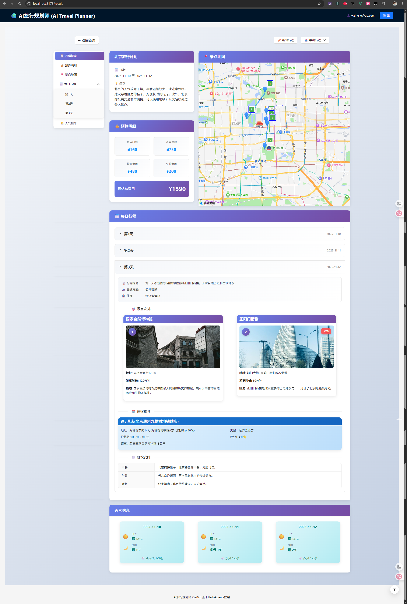

# AI旅行规划师 🌍

基于HelloAgents框架构建的智能旅行规划助手,集成高德地图MCP服务,提供个性化的旅行计划生成。

[](https://github.com/xinyangwy/AI-Travel-Planner-wzl/actions)
[](https://www.docker.com/)
[](LICENSE)

## ✨ 功能特点

- 🤖 **多智能体协作**: 基于HelloAgents框架的多Agent系统,景点、天气、酒店专家协同工作
- 🗺️ **高德地图集成**: 通过MCP协议接入高德地图服务,支持景点搜索、路线规划、天气查询
- 📊 **实时日志流**: SSE实时推送规划进度,终端风格日志显示,让用户了解每一步
- 🧠 **智能工具调用**: Agent自动调用高德地图MCP工具,获取实时POI、路线和天气信息
- 🎨 **现代化前端**: Vue3 + TypeScript + Vite,响应式设计,流畅的用户体验
- 📱 **完整功能**: 包含住宿、交通、餐饮和景点游览时间推荐
- 🐳 **Docker支持**: 一键部署,支持Docker Compose和Kubernetes
- 🔄 **CI/CD自动化**: GitHub Actions自动构建并推送到阿里云镜像仓库
- 👤 **用户系统**: Supabase认证,支持历史记录保存和查看

旅游规划结果页面：


## 🏗️ 技术栈

### 后端
- **框架**: HelloAgents (多智能体系统)
- **API**: FastAPI + SSE (Server-Sent Events)
- **MCP工具**: amap-mcp-server (高德地图)
- **LLM**: ModelScope (Qwen2.5-72B-Instruct)
- **数据库**: Supabase (PostgreSQL)
- **认证**: Supabase Auth

### 前端
- **框架**: Vue 3 + TypeScript
- **构建工具**: Vite
- **UI组件库**: Ant Design Vue
- **地图服务**: 高德地图 JavaScript API
- **HTTP客户端**: Axios
- **实时通信**: EventSource (SSE)

### DevOps
- **容器化**: Docker + Docker Compose
- **CI/CD**: GitHub Actions
- **镜像仓库**: 阿里云容器镜像服务
- **部署**: 支持 Docker Compose / Kubernetes

## 📁 项目结构

```
AI-Travel-Planner-wzl/
├── backend/                    # 后端服务
│   ├── app/
│   │   ├── agents/            # 多智能体系统
│   │   │   └── trip_planner_agent.py
│   │   ├── api/               # FastAPI路由
│   │   │   ├── main.py
│   │   │   └── routes/
│   │   │       ├── trip.py    # 旅行规划API (含SSE)
│   │   │       ├── map.py     # 地图服务API
│   │   │       └── auth.py    # 认证API
│   │   ├── services/          # 服务层
│   │   │   ├── llm_service.py
│   │   │   ├── auth_service.py
│   │   │   └── database.py
│   │   ├── utils/             # 工具模块
│   │   │   └── log_streamer.py # 日志流管理
│   │   ├── models/            # 数据模型
│   │   │   └── schemas.py
│   │   └── config.py          # 配置管理
│   ├── Dockerfile             # Docker镜像
│   ├── requirements.txt
│   └── .env.example
├── frontend/                   # 前端应用
│   ├── src/
│   │   ├── components/        # Vue组件
│   │   │   └── LogViewer.vue  # 实时日志查看器
│   │   ├── services/          # API服务
│   │   │   ├── api.ts         # HTTP + SSE客户端
│   │   │   └── auth.ts        # 认证服务
│   │   ├── composables/       # Vue组合式函数
│   │   ├── types/             # TypeScript类型
│   │   └── views/             # 页面视图
│   ├── Dockerfile             # Docker镜像
│   ├── nginx.conf             # Nginx配置
│   ├── package.json
│   └── vite.config.ts
├── .github/
│   └── workflows/
│       └── docker-build-push.yml # CI/CD工作流
├── docs/                       # 文档
│   ├── REALTIME_LOGS_USAGE.md
│   ├── REALTIME_LOGS_ARCHITECTURE.md
│   ├── DOCKER_DEPLOYMENT.md
│   └── SETUP_SUPABASE.md
├── docker-compose.yml          # Docker Compose配置
├── DOCKER_QUICK_START.md       # Docker快速开始
└── README.md
```

## 🚀 快速开始

### 方式 1: Docker Desktop 部署（推荐新手）⭐

**最简单的方式，3分钟启动！**

适合 Windows/Mac 用户，使用 Docker Desktop 图形界面：

📖 **详细教程**: [Docker Desktop 快速开始](QUICK_START_DOCKER_DESKTOP.md)

**快速步骤**:
1. 安装 Docker Desktop
2. 创建 `docker-compose.yml` 配置文件
3. 运行 `docker-compose up -d`
4. 访问 http://localhost

### 方式 2: Docker Compose 部署（推荐开发者）

适合命令行用户和生产环境：

```bash
# 1. 克隆仓库
git clone https://github.com/xinyangwy/AI-Travel-Planner-wzl.git
cd AI-Travel-Planner-wzl

# 2. 配置环境变量
cp .env.example .env
# 编辑 .env 文件，填入你的API密钥

# 3. 启动服务
docker-compose up -d

# 4. 访问应用
# 前端: http://localhost
# 后端: http://localhost:8000
```

📖 **详细说明**: 
- [Docker Desktop 详细指南](DOCKER_DESKTOP_GUIDE.md) - 图文并茂，适合新手
- [Docker 快速开始指南](DOCKER_QUICK_START.md) - 命令行方式
- [Docker 部署指南](DOCKER_DEPLOY_GUIDE.md) - 生产环境部署

### 方式 3: 本地开发

适合开发和调试：

#### 前提条件

- Python 3.11+
- Node.js 18+
- 高德地图API密钥
- ModelScope API密钥
- Supabase账号（可选，用于用户认证和历史记录）

### 后端安装

1. 进入后端目录
```bash
cd backend
```

2. 创建虚拟环境
```bash
python -m venv venv
source venv/bin/activate  # Windows: venv\Scripts\activate
```

3. 安装依赖
```bash
pip install -r requirements.txt
```

4. 配置环境变量
```bash
cp .env.example .env
# 编辑.env文件,填入你的API密钥
```

5. 启动后端服务
```bash
uvicorn app.api.main:app --reload --host 0.0.0.0 --port 8000
```

### 前端安装

1. 进入前端目录
```bash
cd frontend
```

2. 安装依赖
```bash
npm install
```

3. 配置环境变量
```bash
# 创建.env文件,配置高德地图Web API Key
echo "VITE_AMAP_WEB_KEY=your_amap_web_key" > .env
```

4. 启动开发服务器
```bash
npm run dev
```

5. 打开浏览器访问 `http://localhost:5173`

## 📝 使用指南

### 1. 填写旅行信息

在首页填写以下信息:
- 🏙️ 目的地城市
- 📅 旅行日期和天数
- 🚗 交通方式偏好
- 🏨 住宿偏好
- 🎯 旅行风格标签（历史文化、自然风光、美食等）
- 💬 额外要求（支持语音输入）

### 2. 实时查看规划过程

点击"生成旅行计划"后，可以实时看到：
- 🔧 多智能体系统初始化
- 🔍 景点搜索进度
- 🌤️ 天气查询详情
- 🏨 酒店推荐列表
- 📋 行程生成状态

### 3. 多智能体协作

系统使用三个专业Agent协同工作：
- **景点搜索专家**: 搜索并推荐景点
- **天气查询专家**: 获取天气预报
- **酒店推荐专家**: 推荐合适的住宿
- **行程规划专家**: 整合信息生成完整计划

### 4. 查看详细结果

- 📅 每日详细行程
- 📍 景点信息与地图标记
- 🗺️ 交通路线规划
- ☁️ 天气预报
- 🍽️ 餐饮推荐
- 💰 预算估算

### 5. 历史记录（需登录）

- 📜 查看历史规划
- 🔄 重新查看详情
- 💾 自动保存到云端

## 🔧 核心实现

### 1. 多智能体系统

```python
from hello_agents import SimpleAgent
from hello_agents.tools import MCPTool

# 创建共享的MCP工具
amap_tool = MCPTool(
    name="amap",
    server_command=["uvx", "amap-mcp-server"],
    env={"AMAP_MAPS_API_KEY": "your_api_key"},
    auto_expand=True
)

# 创建景点搜索Agent
attraction_agent = SimpleAgent(
    name="景点搜索专家",
    llm=llm,
    system_prompt=ATTRACTION_AGENT_PROMPT
)
attraction_agent.add_tool(amap_tool)

# 创建天气查询Agent
weather_agent = SimpleAgent(
    name="天气查询专家",
    llm=llm,
    system_prompt=WEATHER_AGENT_PROMPT
)
weather_agent.add_tool(amap_tool)

# 创建酒店推荐Agent
hotel_agent = SimpleAgent(
    name="酒店推荐专家",
    llm=llm,
    system_prompt=HOTEL_AGENT_PROMPT
)
hotel_agent.add_tool(amap_tool)

# 创建行程规划Agent
planner_agent = SimpleAgent(
    name="行程规划专家",
    llm=llm,
    system_prompt=PLANNER_AGENT_PROMPT
)
```

### 2. 实时日志流 (SSE)

```python
from fastapi.responses import StreamingResponse

@router.post("/plan-stream")
async def plan_trip_stream(request: TripRequest):
    async def generate():
        # 发送日志
        log_streamer.emit_log(stream_id, {
            "type": "log",
            "message": "🚀 开始生成旅行计划..."
        })
        
        # 执行规划
        trip_plan = agent.plan_trip(request, stream_id=stream_id)
        
        # 发送结果
        yield f"data: {json.dumps({'type': 'result', 'data': trip_plan})}\n\n"
    
    return StreamingResponse(generate(), media_type="text/event-stream")
```

### 3. 前端实时日志显示

```typescript
// 使用 EventSource 接收 SSE 流
const response = await fetch('/api/trip/plan-stream', {
  method: 'POST',
  body: JSON.stringify(formData)
})

const reader = response.body?.getReader()
const decoder = new TextDecoder()

while (true) {
  const { done, value } = await reader.read()
  if (done) break
  
  const chunk = decoder.decode(value)
  const lines = chunk.split('\n')
  
  for (const line of lines) {
    if (line.startsWith('data: ')) {
      const data = JSON.parse(line.slice(6))
      if (data.type === 'log') {
        // 显示日志
        logViewer.addLog(data.message)
      }
    }
  }
}
```

### 4. MCP工具调用

Agent可以自动调用以下高德地图MCP工具:
- `amap_maps_text_search`: 搜索景点POI
- `amap_maps_weather`: 查询天气
- `amap_maps_direction_walking_by_address`: 步行路线规划
- `amap_maps_direction_driving_by_address`: 驾车路线规划
- `amap_maps_direction_transit_integrated_by_address`: 公共交通路线规划
- `amap_maps_around_search`: 周边搜索
- `amap_maps_search_detail`: POI详情查询

## 📄 API文档

启动后端服务后,访问 `http://localhost:8000/docs` 查看完整的API文档。

### 主要端点

#### 旅行规划
- `POST /api/trip/plan` - 生成旅行计划（传统方式）
- `POST /api/trip/plan-stream` - 生成旅行计划（SSE流式，带实时日志）
- `GET /api/trip/history` - 获取历史记录（需登录）
- `GET /api/trip/{plan_id}` - 获取规划详情（需登录）

#### 地图服务
- `GET /api/map/poi` - 搜索POI
- `GET /api/map/weather` - 查询天气
- `POST /api/map/route` - 规划路线

#### 认证
- `POST /api/auth/verify` - 验证token
- `GET /api/auth/user` - 获取用户信息

## 🐳 Docker 部署

### 使用 Docker Compose

```bash
# 启动服务
docker-compose up -d

# 查看日志
docker-compose logs -f

# 停止服务
docker-compose down
```

### 使用阿里云镜像

```bash
# 拉取镜像
docker pull registry.cn-hangzhou.aliyuncs.com/ai-travel-planner/backend:latest
docker pull registry.cn-hangzhou.aliyuncs.com/ai-travel-planner/frontend:latest

# 运行容器
docker run -d -p 8000:8000 --env-file .env \
  registry.cn-hangzhou.aliyuncs.com/ai-travel-planner/backend:latest

docker run -d -p 80:80 \
  registry.cn-hangzhou.aliyuncs.com/ai-travel-planner/frontend:latest
```

详细说明请查看: [Docker 部署指南](docs/DOCKER_DEPLOYMENT.md)

## 🔄 CI/CD 自动化

项目使用 GitHub Actions 实现自动化部署：

1. **推送代码到 main 分支**
2. **自动触发构建流程**
3. **构建 Docker 镜像**
4. **推送到阿里云镜像仓库**
5. **自动打标签** (latest, version, sha)

查看工作流: [.github/workflows/docker-build-push.yml](.github/workflows/docker-build-push.yml)

## 📚 文档

- [实时日志使用说明](docs/REALTIME_LOGS_USAGE.md)
- [实时日志架构设计](docs/REALTIME_LOGS_ARCHITECTURE.md)
- [Docker 部署指南](docs/DOCKER_DEPLOYMENT.md)
- [Docker 快速开始](DOCKER_QUICK_START.md)
- [Supabase 配置指南](SETUP_SUPABASE.md)

## 🎯 功能演示

### 实时日志流

```
🔄 获取多智能体系统实例...
✅ 多智能体系统就绪 (共 16 个工具)
  🔧 工具: amap_maps_text_search
  🔧 工具: amap_maps_weather
  🔧 工具: amap_maps_around_search
  ... 还有 13 个工具
🚀 开始生成旅行计划...
============================================================
🚀 开始多智能体协作规划旅行...
目的地: 西安 | 日期: 2025-11-10 至 2025-11-12 | 天数: 3天
============================================================
⚡ 并行查询景点、天气、酒店信息...
🔍 开始搜索西安的景点...
✅ 找到景点信息
  📌 兵马俑博物馆
     📍 陕西省西安市临潼区秦陵北路...
  📌 大雁塔
     📍 陕西省西安市雁塔区雁塔路...
✅ 共找到 18 个景点
🌤️ 查询西安的天气信息...
✅ 获取到天气数据
  📅 2025年11月10日
    ☀️ 白天: 多云 0°C 西风 1-3 级
    🌙 夜间: 晴 -8°C 西风 1-3 级
✅ 已显示 3 天天气预报
📋 生成行程计划...
✅ 旅行计划生成完成!
```

## 🤝 贡献指南

欢迎提交Pull Request或Issue!

### 开发流程

1. Fork 本仓库
2. 创建特性分支 (`git checkout -b feature/AmazingFeature`)
3. 提交更改 (`git commit -m 'Add some AmazingFeature'`)
4. 推送到分支 (`git push origin feature/AmazingFeature`)
5. 开启 Pull Request

## 📜 开源协议

CC BY-NC-SA 4.0

## 🙏 致谢

- [HelloAgents](https://github.com/HelloAgentsAI/hello-agents) - 多智能体框架
- [高德地图开放平台](https://lbs.amap.com/) - 地图服务
- [amap-mcp-server](https://github.com/sugarforever/amap-mcp-server) - 高德地图MCP服务器
- [ModelScope](https://modelscope.cn/) - LLM服务
- [Supabase](https://supabase.com/) - 后端服务
- [Vue.js](https://vuejs.org/) - 前端框架
- [FastAPI](https://fastapi.tiangolo.com/) - 后端框架

## 📊 项目统计

- ⭐ Stars: 欢迎 Star 支持
- 🍴 Forks: 欢迎 Fork 使用
- 📝 Issues: 欢迎提出问题
- 🔀 Pull Requests: 欢迎贡献代码

## 🔗 相关链接

- [GitHub 仓库](https://github.com/xinyangwy/AI-Travel-Planner-wzl)
- [在线演示](https://your-demo-url.com) (待部署)
- [问题反馈](https://github.com/xinyangwy/AI-Travel-Planner-wzl/issues)
- [更新日志](CHANGELOG.md)

## 📞 联系方式

如有问题或建议，欢迎通过以下方式联系：

- 📧 Email: your-email@example.com
- 💬 Issues: [GitHub Issues](https://github.com/xinyangwy/AI-Travel-Planner-wzl/issues)

---

**AI旅行规划师** - 让旅行计划变得简单而智能 🌈

Made with ❤️ by [xinyangwy](https://github.com/xinyangwy)

